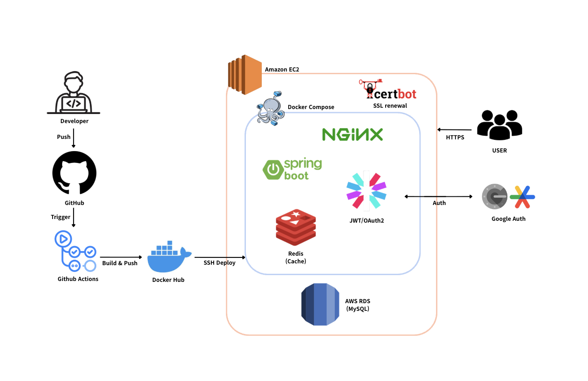

<h1 align="center">❄️ Naengjango Backend</h1>

충동구매를 줄이기 위해 소비를 24시간 “냉동”하는 서비스  
지연·실패·보상 구조를 게임화하여 절약 습관을 유도합니다.

  
  
  
  
  
  
  
  

---

## 👥 Team

| Role         | Name | GitHub |
|--------------|------|--------|
| Backend Lead | 임준서  | [@junjunseo](https://github.com/junjunseo) |
| Backend      | 이정환  | [@ljh8450](https://github.com/ljh8450) |
| Backend      | 주성아  | [@zoosungah](https://github.com/zoosungah) |

> Cotato 12기 프로젝트

---

## 🏗 Architecture

  

## 🛠 Tech Stack

### 🔹 Backend
- Java 21
- Spring Boot 3.x
- Spring Security
- JWT Authentication
- OAuth2 (Google Login)
- JPA (Hibernate)
- Scheduler

### 🔹 Database & Cache
- MySQL 8.x
- Redis (Refresh Token 저장)

### 🔹 Infra
- AWS EC2
- Docker
- Nginx
- Certbot
- GitHub Actions

---

## 📂 Project Structure

    naengjango-backend/
    ├── global/
    │   ├── config/
    │   ├── security/
    │   ├── exception/
    │   └── common/
    │
    ├── domain/
    │   ├── member/
    │   ├── freeze/
    │   ├── igloo/
    │   ├── snowball/
    │   └── transaction/

> 도메인 중심 구조 (Domain-driven design)

---

## 브랜치 전략

- `main`  
  - 배포 브랜치
  - 직접 push 금지
  - Pull Request로만 병합

- `develop`  
  - 개발 통합 브랜치
  - 모든 feature 브랜치는 develop에서 분기

- `feature/*`  
  - 기능 단위 브랜치
  - 작업 완료 후 develop으로 PR

## 커밋 컨벤션
| type | 의미 | 예시 |
| --- | --- | --- |
| **feat** | 새로운 기능 | 로그인 API 구현 |
| **fix** | 버그 수정 | NPE 해결 |
| **docs** | 문서 수정 | README 업데이트 |
| **chore** | 빌드·설정 변경 | Gradle 설정 변경 |
| **refactor** | 기능 변화 없는 코드 리팩터링 | Service 분리 |
| **style** | 포맷/세미콜론/네이밍 등 | 포맷팅 |
| **test** | 테스트 코드 | Controller 단위 테스트 |